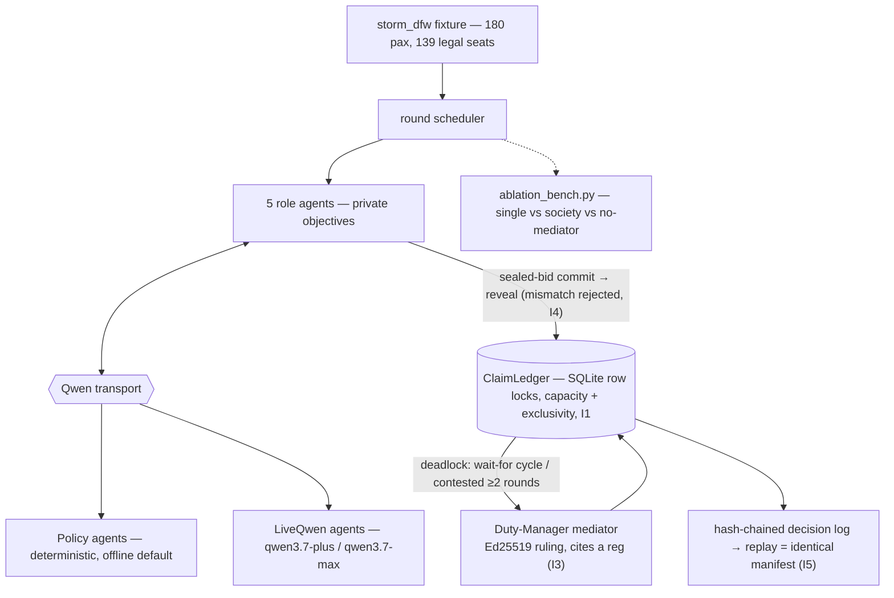

<div align="center">
  
  <h1>✈️ Tarmac</h1>
  <p><em>Five agents fight over nine seats so the right people fly — an airline irregular-ops society that beats a single planner, provably.</em></p>
  

  <br/><br/>

  [](https://tarmac.edycu.dev)
  [](https://tarmac.edycu.dev/pitch/)
  [](DEMO.md)
  [](https://qwencloud-hackathon.devpost.com/)
  [](LICENSE)

  <br/>

  
  
  
  [](https://github.com/edycutjong/tarmac/actions/workflows/codeql.yml)
  [](https://github.com/edycutjong/tarmac/actions/workflows/ci.yml)
</div>

> **Track 3: Agent Society.** An airline irregular-operations society where the
> conflict *is* the architecture: Rebooking, Crew-Legality, Gate/Ground, Hotel,
> and Passenger-Advocate agents hold genuinely opposed objectives and negotiate
> over **revocable claims on a row-locked seat ledger** (sealed-bid in contested
> rounds). A Duty-Manager mediator resolves mechanically-detected deadlocks with
> **Ed25519-signed, regulation-cited rulings** — and an ablation benchmark proves
> the society beats a single planner, the exact *"measurable efficiency gain over
> single-agent baselines"* the track asks for.

> *A 12-year-old flying alone watches the DEPARTED board go red at 6 PM. Behind a
> door, one dispatcher with two phones is deciding whether she or the transplant
> cooler gets the last seat to Denver.*

---

## 📊 The one number

On the frozen `storm_dfw` storm (180 displaced passengers, 139 legal seats),
measured across 10 seeds:

| | Single planner | **Full society** |
|---|---|---|
| **Protected passengers stranded** (medical courier, minor, wheelchair, tight connections) | **17** | **3** |
| Special-needs SLA met | **0%** | **100%** |
| Tight connections saved | 0 | 9 |
| Crew duty violations (tested invariant I2) | 1 | **0** |

Seat *supply* is physically fixed, so raw strandings barely move — the society's
win is in **who** flies. The single planner seats a flexible high-fare passenger
on the last compliant nonstop while stranding the courier; the society doesn't.

---

## 🚀 Quickstart (offline, zero keys)

```bash
python3.12 -m venv .venv && ./.venv/bin/pip install -e ".[dev]"

./.venv/bin/tarmac run --scenario storm_dfw --seed 7   # watch the society negotiate
./.venv/bin/tarmac bench                                # the ablation table
./.venv/bin/tarmac verify-log runs/…/run.db             # re-check invariants I1–I5
./.venv/bin/python scripts/verify_offline.py            # zero-key judge path (exit 0)
./.venv/bin/python examples/meeting_rooms.py            # the protocol, non-airline, 20 lines
```

Everything above runs against **deterministic policy agents** — no network, no
API key, byte-identical every time. Add `--live` (and `DASHSCOPE_API_KEY`) to
swap in the real Qwen agents.

## ✅ Testing & CI

**327 tests, all green, 99% coverage** (`./.venv/bin/pytest --cov=tarmac_society`), in ~5 seconds:

```
============================= 327 passed in 4.94s ==============================
```

They cover the ledger's locking + double-claim rejection, sealed-bid commit→reveal
with mismatch rejection, the deadlock detector on synthetic wait-for graphs,
credibility-currency math, the mediator ruling flow, the invariants **I1–I5**, and
the fixture guarantee that `storm_dfw` **always** produces ≥1 genuine deadlock.

```bash
# ── Code Quality ────────────────────────────
ruff check .                                   # lint
mypy src                                       # type check
pytest --cov=tarmac_society --cov-report=term  # unit tests + coverage

# ── Offline / zero-key judge path ───────────
python scripts/verify_offline.py               # society run + I1-I5 replay, exit 0

# ── Security ─────────────────────────────────
pip-audit                                      # dependency vulnerability scan
```

A GitHub Actions pipeline (`.github/workflows/ci.yml`) runs all of the above on
every push/PR — this is a **CLI/library**, not a web app, so the harness
substitutes a deterministic offline-replay gate for the browser E2E/Lighthouse
stages a frontend project would run:

| Layer | Tool | Status |
|---|---|---|
| Code Quality | ruff + mypy | ✅ |
| Unit Testing | pytest (99% coverage, 327 tests) | ✅ |
| Offline Verification | `scripts/verify_offline.py` (I1–I5 replay, zero network) | ✅ |
| Security (SAST) | CodeQL (Python) | ✅ |
| Security (SCA) | Dependabot (pip + github-actions) + pip-audit | ✅ |
| Secret Scanning | TruffleHog | ✅ |
| Build Verification | `python -m build` + wheel install + CLI smoke test | ✅ |

## 📊 The committed ablation

Same storm, three conditions, 10 seeds, offline & deterministic
(`docs/BENCH.md`, regenerate with `tarmac bench`):

| Metric | Single planner | Society − mediator | Full society |
|---|---|---|---|
| Protected pax stranded (SLA-failed) (↓ better) | 17 | 14 | 3 |
| Stranded overnight (no seat) (↓ better) | 52 [50–53] | 96 [81–109] | 50 [49–52] |
| Tight connections saved (↑ better) | 0 | 3 | 9 |
| Special-needs SLA met (%) (↑ better) | 0.0 | 0.0 | 100.0 |
| Crew duty violations (↓ better) | 1 | 0 | 0 |
| Rounds to quiescence (↓ better) | 1 | 6 | 5 |
| Contest stake (credibility) (↓ better) | 0 | 60 | 40 |

The **Society − mediator** column is the point: strip out adjudication and the
society is *worse than a single planner* (96 stranded), because contested claims
get quarantined at the round cap with no one to rule. The mediator is
load-bearing, not decorative.

## 🏗️ How it works



<sub>**As built** = offline uses deterministic **policy agents** (genuinely negotiate/deadlock/resolve on the fixture); live mode swaps in Qwen LLM agents behind `DASHSCOPE_API_KEY`. Storage is SQLite; ECS is documented (`infra/ecs/`), not deployed. Plain-text view below.</sub>

```
storm fixture ─▶ round scheduler ─▶ 5 role agents (private objectives)
                                       │  sealed-bid commit  SHA256(claim‖nonce)
                                       ▼  reveal (mismatch → rejected, I4)
                              ClaimLedger  (SQLite row locks, capacity + exclusivity, I1)
                                       │
                              DeadlockDetector  (wait-for cycle / contested ≥2 rounds)
                                       ▼
                              Duty-Manager mediator  → Ruling (Ed25519-signed, cites a reg, I3)
                                       ▼
                              hash-chained decision log  → replay reproduces the manifest (I5)
```

- **Claims are function calls, not sentences** — a claim is a typed mutation against
  a ledger with real row-level locking, so contention has physics (two threads
  racing the last seat: exactly one wins — tested).
- **Sealed bids** (`SHA256(claim‖nonce)`) mean rival agents can't adapt a bid after
  seeing another's; the ledger rejects any reveal that doesn't re-derive its digest.
- **Deadlock is mechanical** — a wait-for cycle or a resource contested ≥2 rounds —
  so mediation is *triggerable*, never vibes-based.
- **Every ruling is signed and cited** — a portable artifact: with the public key
  you can verify *what was decided and on what regulation* without trusting the DB.
- **Credibility currency** bounds argument economically: contesting costs points,
  winning refunds + a premium, losing burns them — no infinite loops.

The negotiation core ships as **`tarmac-society`**, a domain-agnostic library
(`ClaimLedger`, `DeadlockDetector`, `Commitment`, `Mediator`, `Society`,
`verify_log`). `examples/meeting_rooms.py` reuses it for room booking in 20 lines.

## 🧩 Why only Qwen Cloud

| Qwen surface | What it buys the society | Without it |
|---|---|---|
| `qwen3.7-plus` × 5 role agents | persona-stable objectives across ~60 turns/run, cheap enough to *measure* | frontier pricing makes a *benchmarked* society unaffordable |
| `qwen3.7-max` + thinking (mediator) | adjudicating 5 conflicting position papers with citations | plus-tier rulings split the difference and break duty clocks |
| structured output (Claim/Position/Ruling) | the ledger executes claims mechanically; malformed = rejected | free-text negotiation → nothing lockable, auditable, replayable |
| function calling (ledger ops) | typed state mutations with row locks | "I take seat 14C" has no physics |
| **context cache** (shared disruption prefix) | the 4k-token storm prefix reused every turn | ~10× token cost; the ablation dies |
| Batch API | 60-run ablation offline at −50% | the track's benchmark costs more than iterating is worth |
| `text-embedding-v4` | regulation-passage retrieval so rulings cite sources | uncited rulings are vibes with a signature |

Take Qwen Cloud out and Tarmac still *runs* — but it can no longer be
**measured**, and an unmeasured agent society is exactly the group-chat demo this
track is drowning in. The transport is swappable (`FakeQwen` ↔ `LiveQwen`); every
other part — sealed bids, ledger physics, deadlock detection, signing, logging —
is identical between offline and live.

The `LiveQwen` DashScope integration is not vaporware behind a flag: **19
deterministic tests** (`tests/test_qwen_transport.py`, a stub OpenAI-shaped
client) drive the real wire path offline — the `qwen3.7-plus` / `qwen3.7-max`
model routing, the embedded-JSON-schema structured-output contract, the single
reject-and-retry on invalid JSON, the `enable_thinking` flag on the mediator,
per-agent claim/position filtering, and `text-embedding-v4` batching. Flipping on
`--live` executes that already-verified path; it only adds tokens, not new code.
The one thing offline can't show is a live model's *judgement*, so a real
`DASHSCOPE_API_KEY` run is the honest remaining step (see **Status**).

## 📋 Status — honest

| Area | State |
|---|---|
| Negotiation protocol, ledger, deadlock, mediator, signing, chain-log | **Done & tested** (327 tests) |
| `storm_dfw` fixture + generator + committed `fixtures/storm_dfw_seed7.json` | **Done**, deadlock guaranteed |
| Offline society (deterministic **policy** agents) | **Done** — the default; no key, byte-stable |
| Ablation bench (3×10) + `verify_offline` + readiness check | **Done**, table committed |
| Live Qwen agents (`qwen3.7-plus` / `qwen3.7-max` / `text-embedding-v4`) | **Wired + wire-tested** behind `DASHSCOPE_API_KEY` (`--live`): 19 deterministic tests exercise the DashScope structured-output contract, one-retry, thinking flag, per-agent filtering & embeddings against a stub client (zero tokens). The offline policies are the graded path; a real key runs the same, already-verified wire path. |
| Alibaba Cloud ECS deploy | **Not deployed** — setup documented in `infra/ecs/setup.md` |
| Ops-board UI | **Deferred** — a static `runs/<id>/report.html` transcript is a nice-to-have, not shipped |

**Limitations.** Tarmac is a **simulator**: synthetic reservation data, one curated
storm (plus a seeded generator). It is decision-support and rehearsal, not a live
GDS integration. LLM nondeterminism in live mode is bounded (temp 0.2, seeded,
medians of 10) but not eliminated; the *offline* path is fully deterministic.

## 🤝 Contributing

Issue/PR templates, a Code of Conduct, and a security policy live under
[`.github/`](.github/). See [`.github/CONTRIBUTING.md`](.github/CONTRIBUTING.md)
for the dev-setup and pre-PR checklist.

## 📄 License

[MIT](LICENSE) © 2026 Edy Cu. Built solo in one day of a multi-project sprint.

## Versioning

This project uses [Semantic Versioning](https://semver.org) with **fully automated** version
management driven by [Conventional Commits](https://www.conventionalcommits.org) — the version is
never edited by hand.

| Commit type | Bump | Example |
|---|---|---|
| `fix: …` | patch | 1.0.0 → 1.0.1 |
| `feat: …` | minor | 1.0.0 → 1.1.0 |
| `feat!: …` or `BREAKING CHANGE:` footer | major | 1.0.0 → 2.0.0 |

[python-semantic-release](https://python-semantic-release.readthedocs.io) keeps the version in sync
across `pyproject.toml` and `src/tarmac_society/__init__.py`.

- **In CI/CD:** Stage 6 of the pipeline (`.github/workflows/ci.yml`) runs on every push to `main`,
  computes the next version from the commits since the last tag, then commits + tags it automatically.
- **Locally:**
  ```bash
  pip install -e ".[release]"
  semantic-release version    # compute + apply the next version and tag
  ```

